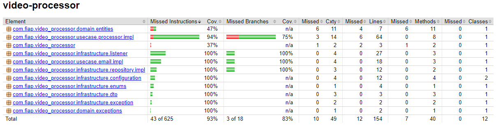

# video-processor

## Visão Geral
Este repositório é responsavel pelo processamento de video para o **Hackaton** FIAP

## Funcionalidades do Sistema

### Processamento
- **Processamento de video**: Extrai frames de um video, cria zip e envia no email definido na request.

## Ambiente de Desenvolvimento

- **Java 21**
- **Maven**: Apache Maven 3.9.10
- **Banco de Dados**: PostgreSQL 17
---

## Cobertura de testes

# Passo a passo para execução

1. Deve-se definir as seguintes variáveis para execução local:
- POSTGRES_URL
- POSTGRES_USER
- POSTGRES_PASSWORD
- SQS_QUEUE_URL
- EMAIL_REMETENTE
- USER_EMAIL
- PASSWORD_EMAIL
2. Para as variaveis de email deve-se, no application.yaml, definir o valor do campo "spring.mail.host" para "smtp.gmail.com" para usar um email simples, então como user, password e remetente, usar as credenciais do email que será responsavel pelo envio.
3. Para usar algum serviço da AWS deve-se definir as variaveis das credencias temporarias:
- AWS_ACCESS_KEY_ID
- AWS_SECRET_ACCESS_KEY
- AWS_SESSION_TOKEN
